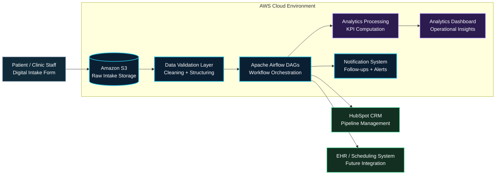

# AI-Driven Clinic Intake Optimization

An interactive portfolio case study demonstrating how manual clinic intake workflows can be transformed into scalable, AI-driven data pipelines with measurable operational and financial impact.

## Preview

---

## Live Demo
https://marinia-portfolio-shani-01.s3.us-west-2.amazonaws.com/marketing-automation/clinic-outreach/clinic_intake_case_study.html

---

## Business Problem

Dermatology clinics rely on manual intake processes that create:

- Front desk bottlenecks  
- Inefficient patient throughput  
- Limited visibility into pipeline performance  
- Poor integration between intake, CRM, and reporting systems  

---

## Solution Overview

This project translates the intake problem into a structured AI + data workflow:

- Digital intake capture (web/tablet forms)  
- Cloud storage (AWS S3)  
- Workflow orchestration (Apache Airflow)  
- CRM + downstream integrations  
- Operational analytics dashboards  

---

## Architecture Diagram

## Key Metrics (From Case Study)

- 31 qualified clinic opportunities  
- $15K target engagement value per clinic  
- 40–60% reduction in intake processing time  
- 10–20% increase in patient throughput  

---

## Tech Stack

- AWS S3 (Storage)  
- Apache Airflow (Workflow orchestration)  
- HubSpot CRM  
- JavaScript (Chart.js for data visualization)  
- HTML/CSS (UI/UX design)  

---

## Key Features

- Animated KPI counters  
- Sequential bar chart animation  
- Line chart growth visualization  
- Scroll-triggered UI animations  
- Data-driven storytelling for business stakeholders  

---

## What This Demonstrates

This project showcases my ability to:

- Translate business problems into technical architectures  
- Design scalable AI/data workflows  
- Build executive-ready data visualizations  
- Bridge operations, analytics, and engineering  

---

## Author

Shani Sambrano  
AI/ML Data Architect | Fractional CDO  
Marinia Group, LLC
